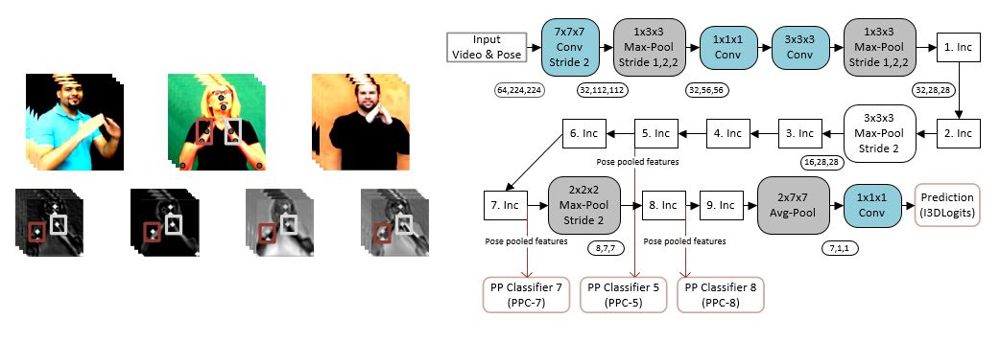
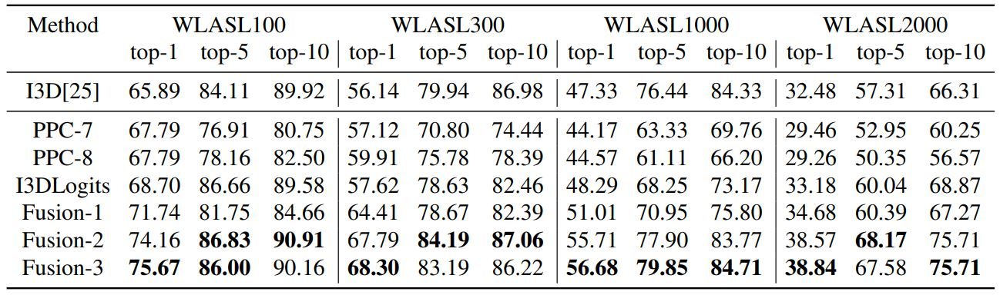

# Pose-Pooling-3dConvNet
Pose pooling 3d Convolutional Neural Network (I3D) for isolated sign word recognition from video. <br>
**Summary :** Sign video classifier (I3D) network uses localized feature maps extracted using pose locations of hands.

## Network Architecture


## Publication
```
@article{poseGuidedPoolingHosain,
  title={Hand Pose Guided 3d Pooling for American Sign Language Recognition},
  author={Hosain, Al Amin and Selvam, Panneer and Pathak, Parth and Rangwala, Huzefa and Kosecka, Jana},
  booktitle={In Proceedings of Winter Conference of Application in Computer Vision (WACV), 2021},
  year={2021}
}
```
## Requirements
Python, PyTorch

## Mention
Most of the base code scripts and data are obtained from [WLASL](https://github.com/dxli94/WLASL) project

## Training the Network
1. Download and preprocess the data from [WLASL](https://github.com/dxli94/WLASL)
2. Put the preprocessed data in a directory titled such as ```downloaded_data```
3. Set few variables in the ```__main__``` section of training script titled as ```train_network.py```
    - root : location where preprocessed data saved
    - save_model : location where checkpoints will be stored during the training process
    - train_split & configuration files : which subset of WLASL dataset used in training procedure
    - weights : this variables points to a pre-trained weight stored under ```weights``` directory
4. Run the training script simply using the command, ```python train_network.py -end_point <I3D Endpoint>```
5. The ```end_point``` option will take I3D network end point as value. Classifier will be trained using hand pose guided features from this branch.

## Evaluating the Network
Evaluation can be done in different ways
### Evaluation on a single I3D branch
1. Need to specify a pre-trained model using ```-checkpoint/-ckpt``` option
2. For example the evaluation command will be ```python evaluate_network.py -end_point <opt1> -checkpoint <opt2>```
    - opt1 : a valid end point name from I3D network, some examples are ```Mixed_4f, Mixed_4b, Mixed_5b```
    - opt2 : a saved checkpoint name, the script expects the specified checkpoint is under the ```saved_checkpoint``` directory
3. By default, this script expects the pre-trained model will be in the ```saved_checkpoint``` directory
4. During the training, checkpoints are saved in ```checkpoints``` directory, hence to evaluate a checkpoint you need to copy to ```saved_checkpoint``` directory

### Evaluation on multiple I3D branches
In this process, we have to first save logits from different branches using different trained classifier for those branches. 
#### Saving Logits from a specific branch
  - ```python evaluate_network.py -end_point <opt1> -checkpoint <opt2> -run_mode <opt3> -logit_loc <opt4>```
    - opt3 : mode of running this script, this case the value is ```save_logits```
    - opt4 : a complete direcotry location where logits for each test video will be stored
#### Aggregating scores from different branches
  - ```python evaluate_network.py -end_point <opt1> -checkpoint <opt2> -run_mode <opt3> -logit_loc <opt4> -logit_list <opt5>``` 
    - opt3 : mode of running this script, this case the value is ```run_logits```
    - opt4 : parent directory location where logits from different branches are saved, one in a specific folder
    - opt5 : a comma separated list of folder location under the directory provided by the option ```opt4```
## Results

